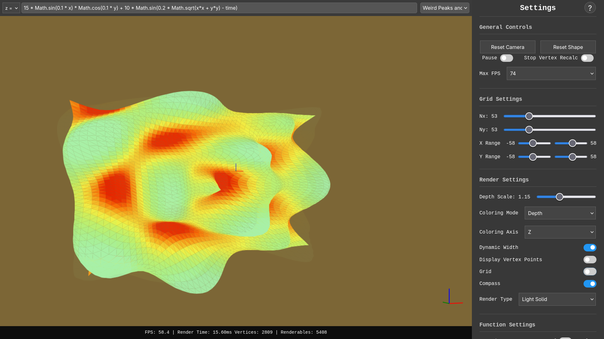
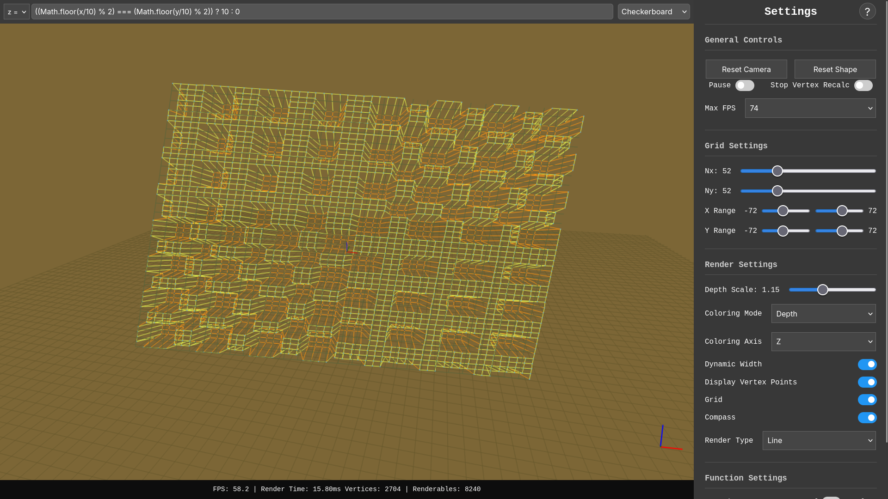
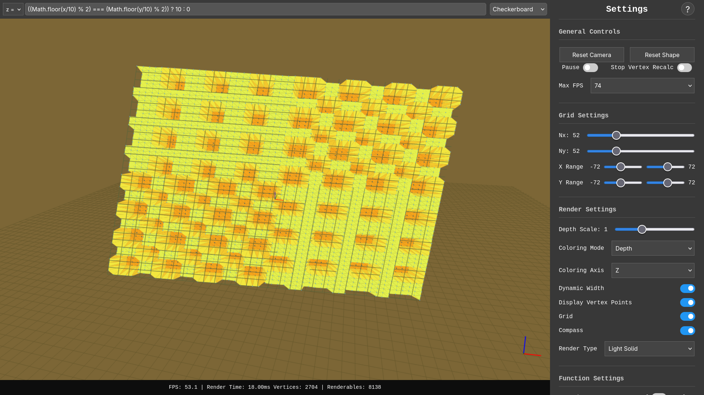
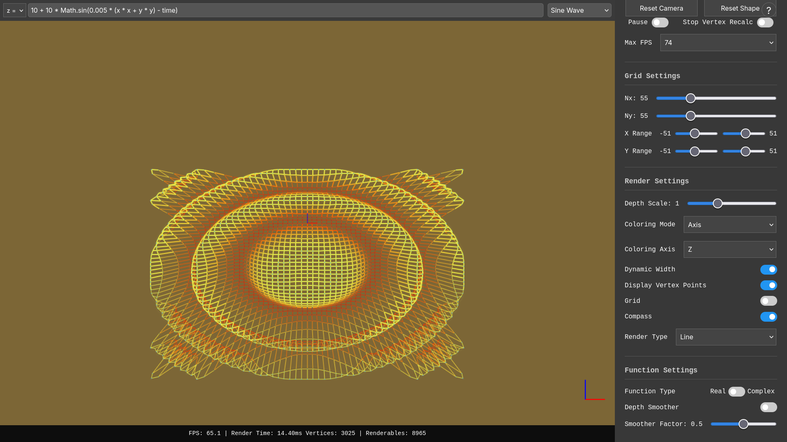
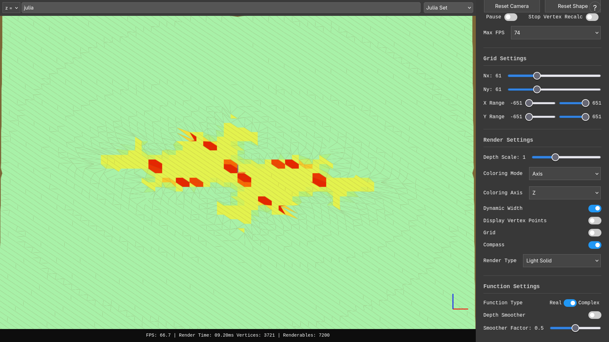
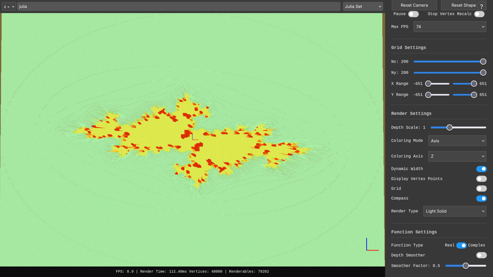
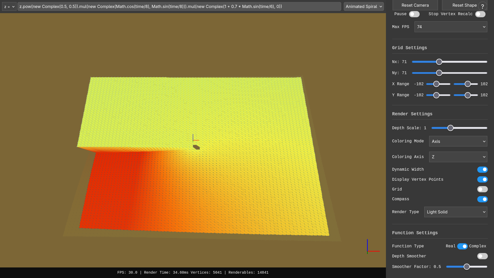
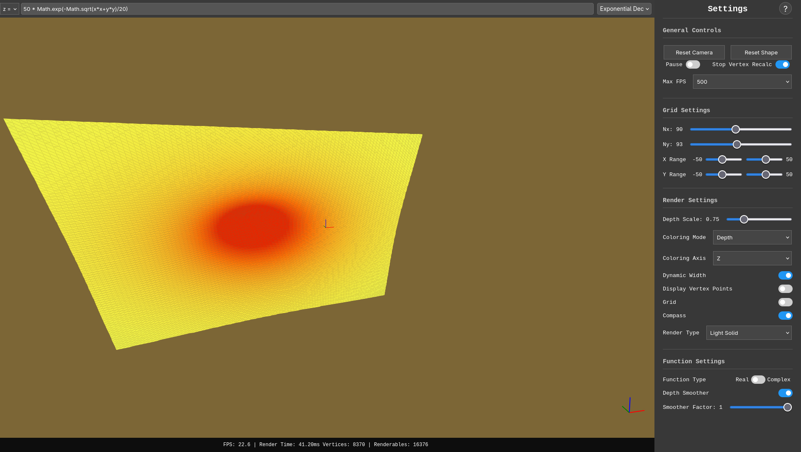

# 3d_function_canvas — 3D Render of Mathematical functions 🎨🧮

This repository contains a small JavaScript renderer that visualizes mathematical functions in 3D on an HTML5 canvas. It was originally a fun cube renderer (see tests/*) that evolved into a tool for exploring real and complex-valued functions on 3D surfaces as best as i could (Thanks 12a74n18 🦮)


## Purpose 🎯

- Explore visual representations of real and complex functions on 3D surfaces.
- Learn projection mathematics, simple camera handling, mesh sampling, and rendering techniques on a 2D canvas.
- Experiment with color mapping, Perlin noise, and visualization of special behaviors (e.g., zeta function, julia set, singularities).
- Minimal and lazy parser for user-defined functions.

## Image gallery 🖼️

A compact gallery — click thumbnails to view full size.

[](./images/image_1.png) | [](./images/image_2.png) | [](./images/image_3.png)
--- | --- | ---
[](./images/image_4.png) | [](./images/image_5.png) | [](./images/image_6.png)
[](./images/image_7.png) | [](./images/image_8.png) | [](./images/image_9.png)

## Project structure 📂

- `index.html` — example page hosting the canvas.
- `src/` — main JavaScript code
  - `3d.js` — 3D utilities (projection, matrices, helpers)
  - `camera.js` — camera logic and view transforms
  - `complex.js` — complex number utilities (exploring complex-valued functions)
  - `function_manager.js` — parsing and managing functions to plot
  - `index.js` — entry point and render loop
  - `shape.js` — mesh / surface construction
- `libs/` — third-party libs (not mandatory) (`chroma.min.js`, `perlin.js`, ...)
- `styles/` — CSS for the page and minimal UI
- `utils/` — helpers: canvas, DOM, input, parsing
- `tests/` — small test scripts (e.g. `cube_test.js`, `zeta_formula_test.js`)
- `images/` — example renders and screenshots


## Key features & techniques ✨

- 2D canvas rendering (no WebGL): manual 3D → 2D projection pipeline. 🖼️
- Pipeline: sample function to build a mesh → apply camera transforms → painter's-algorithm z-sorting → draw to canvas.
- Simple camera with translation and rotation; basic perspective projection. 📷
- Custom function parser supporting basic arithmetic, trigonometric, exponential, logarithmic functions (Javascript) and custom variables such as `x`, `y`, `time`, `i`. 📝
- Support for complex numbers to visualize complex-valued functions (magnitude, phase, special functions). [WIP / Incomplete Work] 🔢
- Color mapping to encode meaningful visual cues (height, magnitude, phase). 🌈
- Managing user input (keyboards, cursor) to navigate the 3D scene and changing some settings. 🎮
- Simple UI/UX for entering functions and adjusting parameters. 🛠️
- Basic optimizations: adjustable sampling resolution, simple culling, and `requestAnimationFrame` for animation. ⚡


## Technical challenges & known limitations ⚠️

- Static sampling: regions with high variation would benefit from adaptive sampling to balance quality and performance. 🔎
- Depth handling and sorting: painter's-algorithm has limits (self-intersections, complex occlusions). Without a z-buffer or WebGL, visual artifacts can appear. 🧩
- Performance: As this is a fun project on a js canvas, everything work on the CPU so it doesn't fit big renders. 🚀
- Numerical precision: I reckon complex functions are badly handled, and preset functions such as Zeta, Mandlelbrot, Julia sets are utterly shit. 🧮
- Portability: rendering depends on browser canvas implementations (antialiasing, subpixel rendering, fonts, etc.). 🌐
- Parsing: The function parser is minimal and lazy, which limits the complexity of functions that can be accurately represented, and it used to create crashes. 📝
- Minimal UI/UX: there is no advanced function editor or adaptive sampling controls. 🛠️
- I am well aware that my DOM management (related to settings) is absolutely criminal. 🍴

A lot of these limitations are by choice of not doing something too big, i am still mad by how i manage complex-valued function though.

## Usage examples 🚦

1. Honestly i usually just open `index.html` directly in a browser.

2. I reckon we could make it a web server by serving the project root using `index.html`:

```sh
python3 -m http.server 8000
# then open http://localhost:8000
```

3. The tests HTML and scripts are in tests/*

## What I learned 🧩

- Mathematics of perspective projection and 3D matrices.
- Visualizing complex functions (magnitude/phase, singularities). 🔍
- Rendering techniques on 2D canvas and balancing things to get a good quality render. ⚖️
- Color mapping strategies, distance from camera to shape manager to make the display appealing. 🎨
- Basic camera controls and user input handling in a 3D context. 🎮
- Importance of profiling and simple optimizations (reduce sampling, limit redrawn triangles). 🧪

## TODO / Work in progress 🛠️ (Unlikely)

- Improve complex function support (more functions, better parsing, visual cues). 🔢
- Adaptive sampling based on function variation to improve quality/performance. 🎯
- Better depth handling (z-buffer or hybrid approach) to reduce artifacts. 🧩
- More user-friendly UI for function input and parameter adjustments. 🛠️
- Managing offscreen rendering to improve performance and reduce flickering. 🖥️
- A new Zoom feature to explore details of the functions. 🔍
- Performance optimizations (e.g., offscreen canvas, web workers (i tried it, but it doesn't fit the model well)). ⚡

## Contributing 📶

This repository is primarily an educational playground. I am sure there are a lot of projects out there that do this better than me. Don't lose your time.

---

_January 2026_
